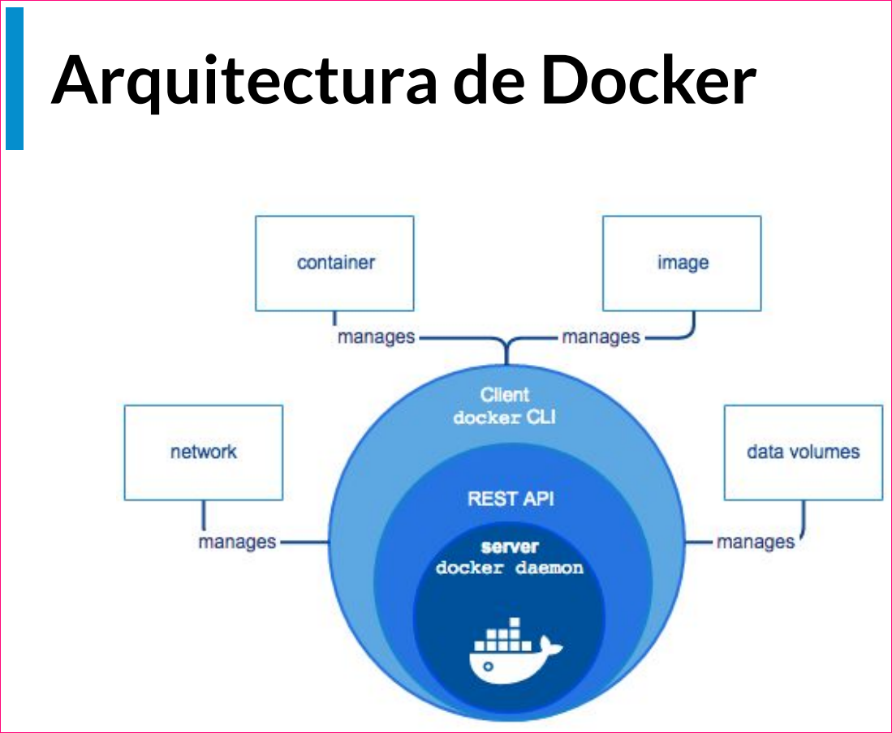

# Curso de Fundamentos de Docker 

> Docker te permite construir,
distribuir y ejecutar cualquier
aplicación en cualquier lado.

### Problemas del desarrollo de software profesional

|Construir|Distribuir|Ejecutar|
|--|--|--|
|Entorno de desarrollo|Divergencia de repositorios|Dependencias de aplicación
|Dependencias|Divergencia de artefactos|Compatibilidad del entorno productivo
|Entorno de ejecucion|Versionado|Disponibilidad de servicios externos
|Equivalencia con entorno |Equivalencia con entorno productivo|Recursos de hardware
|Servicios externos|Servicios externos

### Virtualización

> ... versión virtual de algún recurso
tecnológico, como (...) hardware,
un sistema operativo, un
dispositivo de almacenamiento o
(...) recurso de red.

Permite atacar en simultáneo
los tres problemas del
desarrollo de software
profesional.

#### Problemas de las VMsVirtualización

**Peso**

_En el orden de los GBs. Repiten archivos en común.
Inicio lento._

**Costo de administración**

_Necesita mantenimiento igual que cualquier otra
computadora._

**Múltiples de formatos**

_VDI, VMDK, VHD, raw, etc._

### Containerización 

> El empleo de contenedores para
construir y desplegar software. 

- Flexibles
- Libianos
- Portables
- Bajo acoplamiento
- Escalabres
- Seguros 

> A diferencia de una máquina virtual, que es una abstracción del hardware y emula toda una computadora (o servidor), un contenedor es una abstracción del software y éste puede empaquetar el código, el runtime necesario y las dependencias de una aplicación


### Qué es y cómo funciona Docker



## Contenedores

```shell
docker run hello-world
```

**Cuando listamos los contenedores (con $ docker ps), vemos unas columnas.**

`CONTAINER ID`: El ID del contenedor.

`IMAGE`: El nombre de la imagen.

`COMMAND`: El proceso que ejecuta el contenedor al arrancar.

`CREATED`: Muestra hace cuánto fue creado el contenedor.

`STATUS`: El estado del proceso ejecutado por el contenedor.

`PORTS`: Los puertos abiertos del contenedor.

`NAMES`: El nombre del contenedor.

> El modo interactivo nos permite ingresar a la interfaz de línea de comandos (CLI) del contenedor, como si ingresáramos a un servidor a través de Secure Shell. Para iniciar un contenedor con el modo interactivo, le añadimos al comando docker run el flag -it. Por ejemplo: $ docker run -it ubuntu

**Que es un contenedor?**

- Es una agrupación de procesos.

- Es una entidad lógica, no tiene el limite estricto de las máquinas virtuales, emulación del sistema operativo simulado por otra más abajo.

- Ejecuta sus procesos de forma nativa.

- Los procesos que se ejecutan adentro de los contenedores ven su universo como el contenedor lo define, no pueden ver mas allá del contenedor, a pesar de estar corriendo en una maquina más grande.

- No tienen forma de consumir más recursos que los que se les permite. Si esta restringido en memoria ram por ejemplo, es la única que pueden usar.

- A fines prácticos los podemos imaginar cómo maquinas virtuales, pero NO lo son. Máquinas virtuales livianas.

- Docker corre de forma nativa solo en Linux.

- Sector del disco: Cuando un contenedor es ejecutado, el daemon de docker le dice, a partir de acá para arriba este disco es tuyo, pero no puedes subir mas arriba.

- Docker hace que los procesos adentro de un contenedor este aislados del resto del sistema, no le permite ver más allá.

- Cada contenedor tiene un ID único, también tiene un nombre.

**Estado de Docker**

`$ docker run hello-world` (corro el contenedor hello-world)

`$ docker ps` (muestra los contenedores activos)

`$ docker ps -a` (muestra todos los contenedores)

`$ docker inspect <containe ID>` (muestra el detalle completo de un contenedor)

`$ docker inspect <name>` (igual que el anterior pero invocado con el nombre)

`$ docker run –-name hello-platzi hello-world` (le asigno un nombre custom “hello-platzi”)

`$ docker rename hello-platzi hola-platzy` (cambio el nombre de hello-platzi a hola-platzi)

`$ docker rm` <ID o nombre> (borro un contenedor)

`$ docker container prune` (borro todos lo contenedores que esten parados)

**El Modo Interactivo**

`$ docker run ubuntu` (corre un ubuntu pero lo deja apagado)
`$ docker ps -a` (lista todos los contenedores)
`$ docker -it ubuntu` (lo corre y entro al shell de ubuntu)
`-i: interactivo`
`-t: abre la consola`

`cat /etc/lsb-release` (veo la versión de Linux)