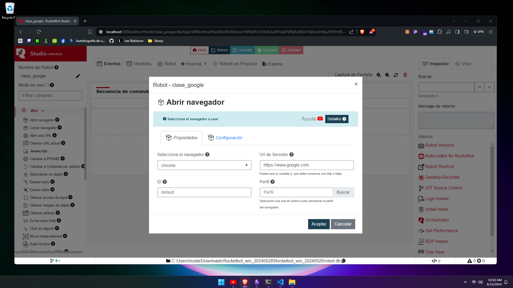
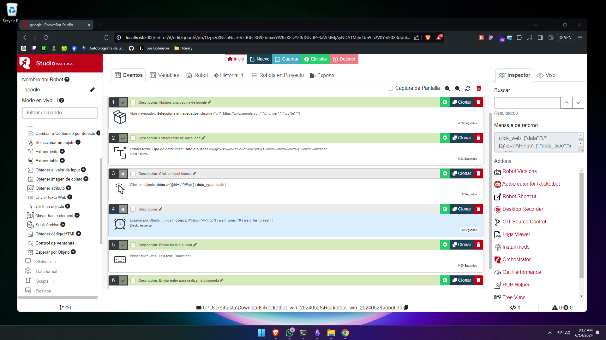

## Mi primer Robot
Creación de un robot
- Creación de variables
- Actualización de datos del robot
- Abrir navegador
- Correr un evento individualmente o ejecutar todo
- Click en objeto seleccionado con xpath en el buscador de google
- Enviar texto web y hacer enter
- Extraer un texto y guardarlo en una variable
- Espera por objeto por si el objeto que buscamos esta disponible
- Crear un condicional por si el objeto nos da verdadero o falso
- Cerrar navegador

### Evidence

