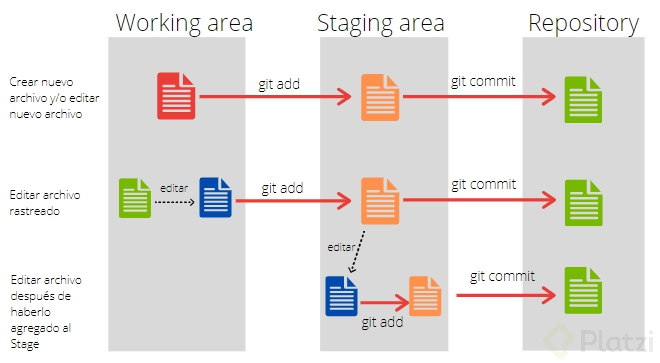

# Comandos Basicos

## Crea un repositorio de git y haz tu primer commit

`git init` _determinamos en la carpeta actual donde sera nuestro repositorio_

`git status` _nos muestra si tenemos actualizados o eliminados de nuestro repositorio, ademas de saber si tenemos algun commit_

`git add` _es para  añadir un archivo a nuestra rama seguidamente ponemos entre comillas el nombre de nuestro archivo o poner un punto para añadir todos los archios de nuestra carpeta._

`git rm` _borrar un archivo que hayamos añadido, para eliminarlo por completo de nuestra rama usamosgit rm --cached._

`git commit` _se usa para añadir un commit a nuestra rama, también podemos ponerle un -m seguidamente ponemos entre comillas nuestro ensaje._

`git config`: muestra configuraciones de git también podemos usar –list para mostrar la configuración por defecto de nuestro git y si añadimos --show-origin inhales nos muestra las configuraciones guardadas y su ubicación.

`git config --global user.name`: cambia de manera global el nombre del usuario, seguidamente ponemos entre comillas nuestro nombre.

`git config --global user.email`: cambia de manera global el email del usuario, seguidamente ponemos entre comillas nuestro nombre.

`git log`: se usa para ver la historia de nuestros archivos, los commits, el usuario que lo cambió, cuando se realizaron los cambios etc. seguidamente ponemos el nombre de nuestro archivo.


## Analizar cambios en los archivos de tu proyecto con Git

`git show` _muestra todos los cambios historicos realizados._

`git log` _muestra el historioal de los registros (commits) del projecto con sus respectivos autores, hora especifica y descripciones._

`git diff` _muestra los cambios que se ha realizados entre el estado actual y el commit especificado por su HASH_
```git
git diff xxxxx xxxxx
# muestra los cambios que se han realizados entre el commit #1 y el commit #2 especificado pos su HASH
```

## Que es el staging?

>_Cuando ejecutamos el comando `git init` se crea un espacio en memoria ram que es el **staging** y es un area totalmente desconectada funciona en memoria ram y es donde al principio se van agregando nuestros cambios.Despues se crea tu repositorio que es la carpeta **.git** donde se van a guardar los cambios finales_

1.- para poner el archivo en staged uso git add

2.- para pasar de staged a tracked uso git commit

3.- unstaged: es un archivo desactualizado de los repositorios. actualizalo con los dos primeros pasos.

4.- untracked : no se ha ejecutado Ningún comando git para ese archivo

**Estados del archivo**

++Untracked: ++
-Cuado aún no se le da git add al archivo, esta sin rastrear.

++Tracked: ++
-Cuando ya se le da el git add y es parte del staging, esta “trackeado”

|Directorio|Staging|Repositorio|
|--|--|--|
|projecto, unracked|tracked, rastreado|master|
||`git add`|`git commit`|
|Hay cambios?|

**Traer un cambio del repositorio**
Si se desea traer un archivo modificado del repositorio pero que no está en nuestra carpeta (básicamente que alguien más lo realizo) vas a esa “rama” y para traer ese archivo a nuestra carpeta se utiliza el comando git checkout.
Dependiendo de como se modifique el comando git checkout se pueden traer todos los cambios, o ciertos cambios o los cambios de ciertos archivos.

Recuerda que cada vez que se hace un git commit del archivo hacia el repositorio sé esta creando varias versiones (v1, v2, v3, etc) cada git commit es una nueva versión de cambios del archivo hacia el repositorio.`git checkout` _nos sirve para actulizar los archivos mas resientes del respositorio_



#### Plus

```bash 
git config --global alias.lg "log --color --graph --pretty=format:'%Cred%h%Creset -%C(yellow)%d%Creset %s %Cgreen(%cr) %C(bold blue)<%an>%Creset' --abbrev-commit"
```
`git log --oneline --decorate`