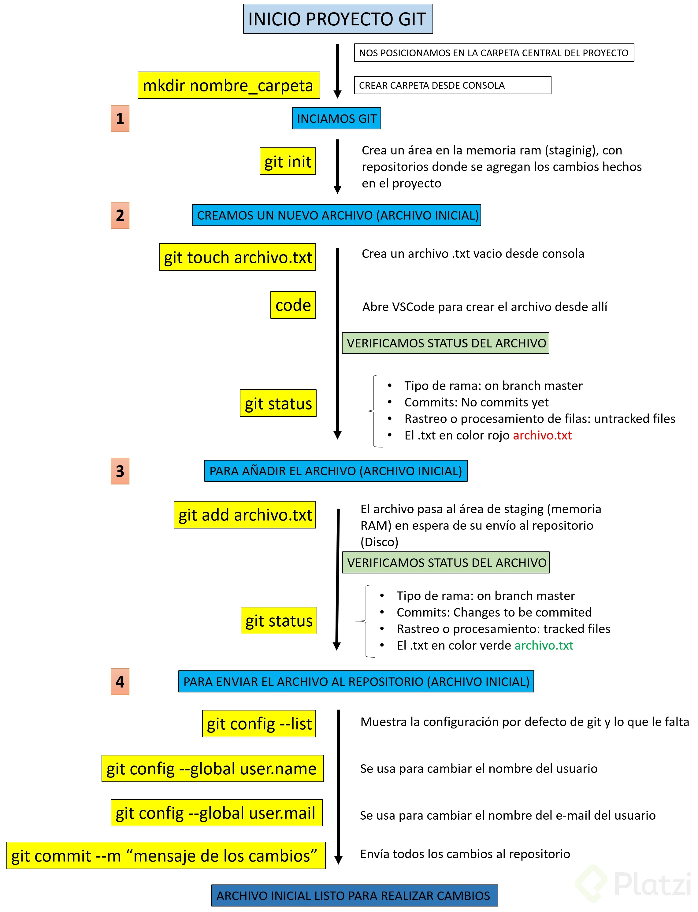

# Comandos Basicos

## Comandos basicos en Git

_Le indicaremos a Git que queremos crear un nuevo repositorio para utilizar su sistema de control de versiones. Solo debemos posicionarnos en la carpeta raíz de nuestro proyecto y ejecutar el comando_
```git
git init
```


Recuerda que al ejecutar este comando (y de aquí en adelante) vamos a tener una nueva carpeta oculta llamada .git con toda la base de datos con cambios atómicos en nuestro proyecto.
Recuerda que Git está optimizado para trabajar en equipo, por lo tanto, debemos darle un poco de información sobre nosotros. No debemos hacerlo todas las veces que ejecutamos un comando, basta con ejecutar solo una sola vez los siguientes comandos con tu información
```git 
git config --global user.email "tu@email.com"
git config --global user.name "Tu Nombre"

```

Existen muchas otras configuraciones de Git que puedes encontrar ejecutando el comando `git config --list` (o solo `git config` para ver una explicación más detallada).

Si quieres ver los archivos ocultos de una carpeta puedes habilitar la opción de `Vista > Mostrar u ocultar > Elementos ocultos` (en Windows) o ejecutar el comando `ls -a.`

### Comandos para iniciar tu repositorio con Git

- `git init`: para inicializar el repositorio git y el staged
- `git add nombre_del_archivo.txt`: enviar el archivo al staged
- `git status`: ver el estado, si se requiere agregar al starget o si se requiere commit
- `git conf`: para ver las posibles configuraciones
- `git conf --list`: para ver la lista de configuraciones hechas
- `git conf --list --show-origin`: para mostrar las configuraciones y sus rutas
- `git rm --cached nombre_del_archivo.txt`: para eliminar el archivo del staged(ram)
- `git rm nombre_del_archivo.txt`: para eliminar del repositorio

Si por algún motivo te equivocaste en el nombre o email que configuraste al principio, lo puedes modificar de la siguiente manera:

`git config --global --replace-all user.name “Aquí va tu nombre modificado”`

O si lo deseas eliminar y añadir uno nuevo

`git config --global --unset-all user.name :Elimina el nombre del usuario`

`git config --global --add user.name “Aquí va tu nombre”`




## Analizar cambios en los archivos de tu proyecto con Git

> _El comando git show nos muestra los cambios que han existido sobre un archivo y es muy útil para detectar cuándo se produjeron ciertos cambios, qué se rompió y cómo lo podemos solucionar. Pero podemos ser más detallados.
Si queremos ver la diferencia entre una versión y otra, no necesariamente todos los cambios desde la creación del archivo, podemos usar el comando git diff commitA commitB.
Recuerda que puedes obtener el ID de tus commits con el comando git log._

### Comandos para analizar cambios en GIT

- `git init`: inicializar el repositorio
- `git add nombre_de_archivo.extensión`: agregar el archivo al repositorio
- `git commit -m “Mensaje”`: Agregamos los cambios para el repositorio
- `git add`: Agregar los cambios de la carpeta en la que nos encontramos agregar todo
- `git status`: visualizar cambios
- `git log nombre_de_archivos.extensión`: histórico de cambios con detalles
- `git push`: envía a otro repositorio remoto lo que estamos haciendo
- `git pull`: traer repositorio remoto
- `git checkout`: traer cambios realizados
- `git rm --cached archivo.extensión`: se utiliza para devolver el archivo que se tiene en ram. Cuando escribimos git add, lo devuelve a estado natural mientras está en staging.
- `git config --list`: muestra la lista de configuración de git
- `git config --list --show-origin`: rutas de acceso a la configuración de git
- `git log archivo.extensión`: muestra la historia del archivo

## Que es el staging?

> El staging es el lugar donde se guardan temporalmente los cambios, para luego ser llevados definitivamente al repositorio. El repositorio es el lugar donde se guardan todos los registros de los cambios realizados a los archivos. Para iniciar un repositorio, o sea, activar el sistema de control de versiones de Git en tu proyecto, solo debes ejecutar el comando `git init`.

### ¿Qué es el área de staging?
El área de staging se puede ver como un limbo donde nuestros archivos están por ser enviados al repositorio o ser regresados a la carpeta del proyecto.

### ¿Qué es git init?
`git init` es el comando que activa git en nuestro proyecto creando un espacio en memoria RAM llamado staging y una carpeta .git.
Este comando se encargará de dos cosas: primero, crear una carpeta .git, donde se guardará toda la base de datos con cambios atómicos de nuestro proyecto; segundo, crear un área que conocemos como staging, que guardará temporalmente nuestros archivos (cuando ejecutemos un comando especial para eso) y nos permitirá, más adelante, guardar estos cambios en el repositorio (también con un comando especial).


### Cómo funciona el staging y el repositorio: ciclo básico de trabajo en git:
El Flujo de trabajo basico en git es algo asi:

1. odificas una serie de archivos en tu directorio de trabajo.
2. Preparas los archivos, añadiéndolos a tu área de preparación (staging).
3. Confirmas los cambios (commit), lo que toma los archivos tal y como están en el área de preparación y almacena esa copia instantánea de manera permanente en tu directorio de git.

Veamos a detalle las 3 seccciones principales que tiene un proyecto en git

#### Working directory
El working directory es una copia de una versión del proyecto. Estos archivos se sacan de la base de datos comprimida en el directorio de git y se colocan en el disco para que los puedas usar o modificar.

#### Staging area
Es un área que almacena información acerca de lo que va a ir en tu próxima confirmación. A veces se le denomina índice (index).

#### .git directory (repository)
En el repository se almacenan los metadatos y la base de datos de los objetos para tu proyecto. Es la parte más importante de git (carpeta .git) y es lo que se copia cuando clonas un repositorio desde otra computadora.

### Ciclo de vida o estados de los archivos en git
Cuando trabajamos con git, nuestros archivos pueden vivir y moverse entre 4 diferentes estados (cuando trabajamos con repositorios remotos pueden ser más estados, pero lo estudiaremos más adelante):

#### Archivos tracked
Son los archivos que viven dentro de git, no tienen cambios pendientes y sus últimas actualizaciones han sido guardadas en el repositorio gracias a los comandos git add y git commit.

#### Archivos staged
Son archivos en staging. Viven dentro de git y hay registro de ellos porque han sido afectados por el comando git add, aunque no sus últimos cambios. Git ya sabe de la existencia de estos últimos cambios, pero todavía no han sido guardados definitivamente en el repositorio porque falta ejecutar el comando git commit.

#### Archivos unstaged
Entiéndelos como archivos “tracked pero unstaged”. Son archivos que viven dentro de git pero no han sido afectados por el comando git add ni mucho menos por git commit. Git tiene un registro de estos archivos, pero está desactualizado, sus últimas versiones solo están guardadas en el disco duro.

#### Archivos untracked
Son archivos que NO viven dentro de git, solo en el disco duro. Nunca han sido afectados por git add, así que git no tiene registros de su existencia.

Recuerda que hay un caso muy raro donde los archivos tienen dos estados al mismo tiempo: staged y untracked. Esto pasa cuando guardas los cambios de un archivo en el área de staging (con el comando git add), pero antes de hacer commit para guardar los cambios en el repositorio haces nuevos cambios que todavía no han sido guardados en el área de staging.

### Comandos para mover archivos entre los estados de Git
Estos son los comandos más importantes que debes conocer:

##### Git reset HEAD
Nos ayuda a sacar archivos del estado staged para devolverlos a su estado anterior. Si los archivos venían de unstaged, vuelven allí. Y lo mismo se venían de untracked.

##### Git rm
Este comando necesita alguno de los siguientes argumentos para poder ejecutarse correctamente:

##### git rm --cached: mueve los archivos que le indiquemos al estado untracked.
git rm --force: elimina los archivos de git y del disco duro. Git guarda el registro de la existencia de los archivos, por lo que podremos recuperarlos si es necesario (pero debemos usar comandos más avanzados).

---

## ¿Qu*é es branch (rama) y cómo funciona un Merge en Git?
> Una **rama o branch** es una versión del código del proyecto sobre el que estás trabajando. Estas ramas ayudan a mantener el orden en el control de versiones y manipular el código de forma segura.
En otras palabras, un branch o rama en Git es una rama que proviene de otra. Imagina un árbol, que tiene una rama gruesa, y otra más fina, en la rama más gruesa tenemos los commits principales y en la rama fina tenemos otros commits que pueden ser de **hotfix**, **devlopment** entre otros.


### Clases de branches o ramas en Git
Estas son las ramas base de un proyecto en Git:

1. #### Rama main (Master)
Por defecto, el proyecto se crea en una rama llamada Main (anteriormente conocida como Master). Cada vez que añades código y guardas los cambios, estás haciendo un commit, que es añadir el nuevo código a una rama. Esto genera nuevas versiones de esta rama o branch, hasta llegar a la versión actual de la rama Main.

2. #### Rama development
Cuando decides hacer experimentos, puedes generar ramas experimentales (usualmente llamadas development), que están basadas en alguna rama main, pero sobre las cuales puedes hacer cambios a tu gusto sin necesidad de afectar directamente al código principal.

3. #### Rama hotfix
En otros casos, si encuentras un bug o error de código en la rama Main (que afecta al proyecto en producción), tendrás que crear una nueva rama (que usualmente se llaman bug fixing o hot fix) para hacer los arreglos necesarios. Cuando los cambios estén listos, los tendrás que fusionar con la rama Main para que los cambios sean aplicados. Para esto, se usa un comando llamado Merge, que mezcla los cambios de la rama que originaste a la rama Main.

**Todos los commits se aplican sobre una rama**. Por defecto, siempre empezamos en la rama Main (pero puedes cambiarle el nombre si no te gusta) y generamos nuevas ramas, a partir de esta, para crear flujos de trabajo independientes.

### Cómo crear un branch o rama en Git
El comando git branch permite crear una rama nueva. Si quieres empezar a trabajar en una nueva función, puedes crear una rama nueva a partir de la rama master con git branch new_branch. Una vez creada, puedes usar git checkout new_branch para cambiar a esa rama.

Recuerda que todas tus versiones salen de la rama principal o Master y de allí puedes tomar una versión específica para crear otra rama de versiones.

### Cómo hacer merge
Producir una nueva rama se conoce como Checkout. Unir dos ramas lo conocemos como Merge.

Cuando haces merge de estas ramas con el código principal, su código se fusiona originando una nueva versión de la rama master (o main) que ya tiene todos los cambios que aplicaste en tus experimentos o arreglos de errores.

Podemos generar todas las ramas y commits que queramos. De hecho, podemos aprovechar el registro de cambios de Git para producir ramas, traer versiones viejas del código, arreglarlas y combinarlas de nuevo para mejorar el proyecto.

Solo ten en cuenta que combinar estas ramas (hacer “merge”) puede generar conflictos. Algunos archivos pueden ser diferentes en ambas ramas. Git es muy inteligente y puede intentar unir estos cambios automáticamente, pero no siempre funciona. En algunos casos, somos nosotros los que debemos resolver estos conflictos a mano.

## Volver en el tiempo en nuestro repositorio utilizando reset y checkout

El comando `git checkout` + `ID del commit` nos permite viajar en el tiempo. Podemos volver a cualquier versión anterior de un archivo específico o incluso del proyecto entero. Esta también es la forma de crear ramas y movernos entre ellas.
También hay una forma de hacerlo un poco más “ruda”: usando el comando `git reset`. En este caso, no solo “volvemos en el tiempo”, sino que borramos los cambios que hicimos después de este commit.
Hay dos formas de usar `git reset`: con el argumento `--hard`, borrando toda la información que tengamos en el área de staging (y perdiendo todo para siempre). O, un poco más seguro, con el argumento `--soft`, que mantiene allí los archivos del área de staging para que podamos aplicar nuestros últimos cambios pero desde un commit anterior.

### Cómo usar Git Reset
Para volver a commits previos, borrando los cambios realizados desde ese commit, podemos utilizar:

- `git reset --soft [SHA 1]`: elimina los cambios hasta el staging area
- `git reset --mixed [SHA 1]`: elimina los cambios hasta el working area
- `git reset --hard [SHA 1]`: regresa hasta el commit del [SHA-1]

Donde el SHA-1 es el identificador del commit

#### Plus

```bash 
git config --global alias.lg "log --color --graph --pretty=format:'%Cred%h%Creset -%C(yellow)%d%Creset %s %Cgreen(%cr) %C(bold blue)<%an>%Creset' --abbrev-commit"
```
`git log --oneline --decorate`