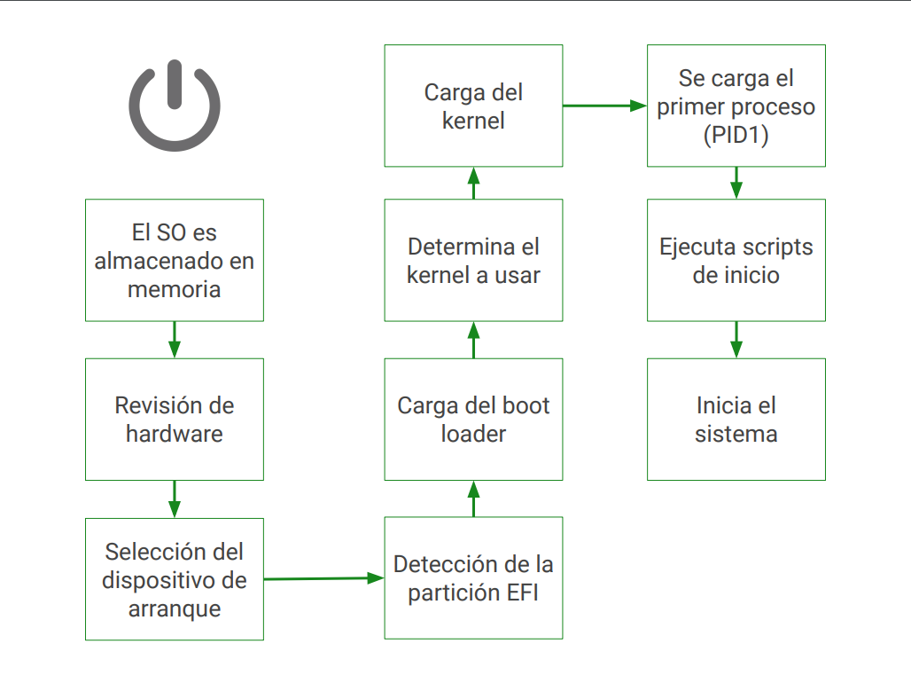

# Curso de Administración de Servidores Linux: Manejo de Recursos

## ¿Cómo es el arranque del sistema?

|Inicio del sistema|Bios|
|--|--|
|Fase 1. bootloader|MBR: Master Boot Record|
|Fase 2. bootloader|LILO o GRUB|
|Kernel (nucleo)|Linux|
|Inicilaiazion|Init|
|Boot Splash|Usplash o Splashy|
|Ambiente grafico|Gnome, KDE, XFCE|
|Usuario|Espacio del usuario|

**Lecturas recomendadas**

[oracle](https://docs.oracle.com/cd/E50691_01/html/E50101/gnchj.html)

[Intel Server](https://www.intel.com/content/www/us/en/support/articles/000033003/server-products.html)

