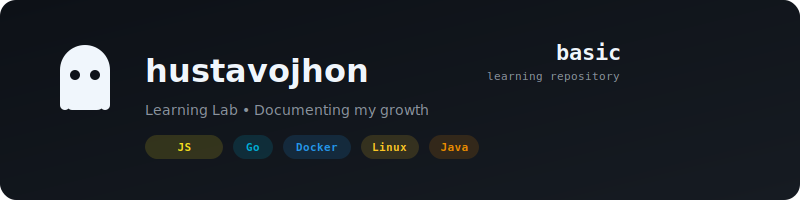

<a id="readme-top"></a>

<!-- ================== HEADER ================== -->
<div align="center">



### 🧠 Mi repositorio de aprendizaje continuo

> Documentación, resúmenes y ejercicios de todo lo que aprendo — desde cursos, tutoriales y práctica personal.

[](#)
[](#)
[](#)

</div>

---

## 📌 Tabla de contenidos

- [📂 Estructura del repositorio](#-estructura-del-repositorio)
- [💻 Tecnologías](#-tecnologías)
- [🗂️ Contenido por sección](#-contenido-por-sección)
- [📚 Recursos de aprendizaje](#-recursos-de-aprendizaje)
- [🚀 Cómo contribuir](#-cómo-contribuir)

---

## 📂 Estructura del repositorio

```
basic/
├── 📐 Arquitecture/          # Patrones y principios de arquitectura
├── 💻 Development/           # Lenguajes y frameworks
│   ├── API/                  # Diseño y consumo de APIs
│   ├── JAVA/                 # Fundamentos de Java
│   ├── JAVASCRIPT/           # JavaScript moderno (ES6+)
│   │   ├── 0 Introduccion/   # Conceptos base
│   │   ├── 1 Fundamentals/    # Variables, primitivos, funciones
│   │   ├── 3 Control Structure/  # Operadores y condicionales
│   │   └── Ejercicios/       # Ejercicios prácticos
│   └── ROCKETBOT/            # Automatización con Rocketbot
├── 📖 Learning/              # Tecnologías emergentes y especializadas
│   ├── BLOCKCHAIN/           # Fundamentos de blockchain
│   ├── LATEX/                # Composición tipográfica
│   └── RESOURCES/            # Recursos de aprendizaje
├── 🔧 Tools/                 # Herramientas de desarrollo
│   ├── DOCKER/               # Contenedores y Docker Compose
│   ├── GIT/                  # Control de versiones
│   └── GITHUB/               # Workflows y GitHub Actions
└── 🐧 Linux/                # Administración Linux
    ├── COMMAND/              # Comandos esenciales
    ├── SECURITY/            # Seguridad en sistemas
    ├── TERMUX/              # Termux en Android
    └── VIM/                 # Editor Vim/Neovim
```

---

## 💻 Tecnologías

### Lenguajes de programación
<div align="left">


</div>

### Frameworks y automatización
<div align="left">


</div>

### Herramientas
<div align="left">


</div>

### Áreas de estudio
<div align="left">


</div>

---

## 🗂️ Contenido por sección

### 📐 Arquitecture
Patrones de diseño, principios SOLID, arquitectura hexagonal y mejores prácticas para estructurar código escalable.

### 💻 Development

| Tema | Descripción |
|------|-------------|
| **API** | REST, GraphQL, consumo de servicios RESTful |
| **JAVA** | Fundamentos, POO, Spring Boot |
| **JAVASCRIPT** | Desde cero hasta conceptos avanzados (ES6+) |
| **ROCKETBOT** | Automatización de tareas y procesos |

### 📖 Learning
- **Blockchain**: Contratos inteligentes, Ethereum, wallets
- **LaTeX**: Documentación técnica profesional
- **Recursos**: Links útiles para seguir aprendiendo

### 🔧 Tools
- **Docker**: Containers, Compose, networking
- **Git**: Versionado, branching, merge strategies
- **GitHub**: Actions, Codespaces, colaboración

### 🐧 Linux
- **Comandos**: Los esenciales del día a día
- **Seguridad**: Hardening, permisos, SSH
- **Termux**: Linux en tu Android
- **Vim/Neovim**: Productividad en el editor

---

## 📚 Recursos de aprendizaje

Estos son algunos de los recursos que uso para aprender:

- [Project Based Learning](https://github.com/practical-tutorials/project-based-learning) — Aprende construyendo proyectos reales
- [Coddy.tech](https://coddy.tech/) — Plataforma de cursos interactivos
- [Guía de Entrevistas de Programación](https://github.com/DevCaress/guia-entrevistas-de-programacion) — Preparación para entrevistas técnicas

---

## 🚀 Cómo contribuir

Este es un repositorio personal de aprendizaje, pero si encuentras errores o quieres sugerir mejoras, siéntete libre de:

1. Fork del repositorio
2. Crear una rama (`git checkout -b mejora/contenido`)
3. Commit tus cambios (`git commit -m 'Actualizo sección X'`)
4. Push a la rama (`git push origin mejora/contenido`)
5. Abrir un Pull Request

---

<div align="center">

**[⬆ Volver arriba](#readme-top)**
|---
| Hecho con 💻 y ☕ por [hustavojhon](https://github.com/hustavojhon)

</div>