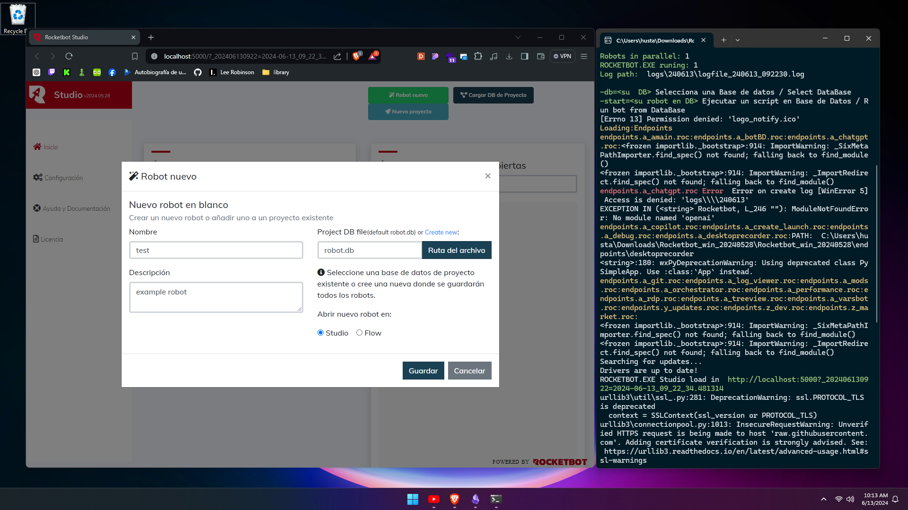
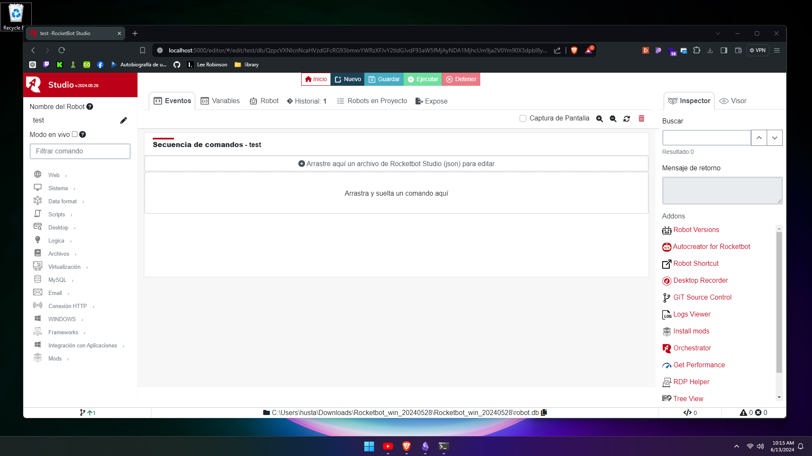

## Estructura Rocketbot
### Documentación
Encuentra la documentación de todos los comandos de Rocketbot Studio [aquí](https://docs.rocketbot.co/)
### Línea de comandos

| Opción            | Descripción                                                                  | Ejemplo                                           |
| ----------------- | ---------------------------------------------------------------------------- | ------------------------------------------------- |
| -start            | Nombre del robot a ejecutar                                                  | rocketbot.exe -start=robot                        |
| -db               | Ruta de la base de datos del robot                                           | rocketbot.exe -start=robot -db=C:/Robots/robot.db |
| --token           | Muestra el token de la licencia de Rocketbot                                 | rocketbot.exe --token                             |
| --log             | Cambia la ruta de los logs de Rocketbot                                      | rocketbot.exe --log=/path/to/logs/folder          |
| --port            | Cambia el puerto por defecto de Rocketbot                                    | rocketbot.exe --port=5001                         |
| --update-drivers  | Revisa y actualiza los drivers de los navegadores cuando se ejecuta un robot | rocketbot.exe -start=robot --update-drivers       |
| --install-modules | Instala los módulos faltantes requeridos por el robot antes de ejecutarlo    | rocketbot.exe -start=robot --install-modules      |
| --no-debug        | Deshabilita el modo debug. Esto deshabilita los logs de la consola           | rocketbot.exe -start=robot --no-debug             |
| -h [--help]       | Muestra la ayuda de los comandos                                             | rocketbot.exe -h                                  |
### Evidence

