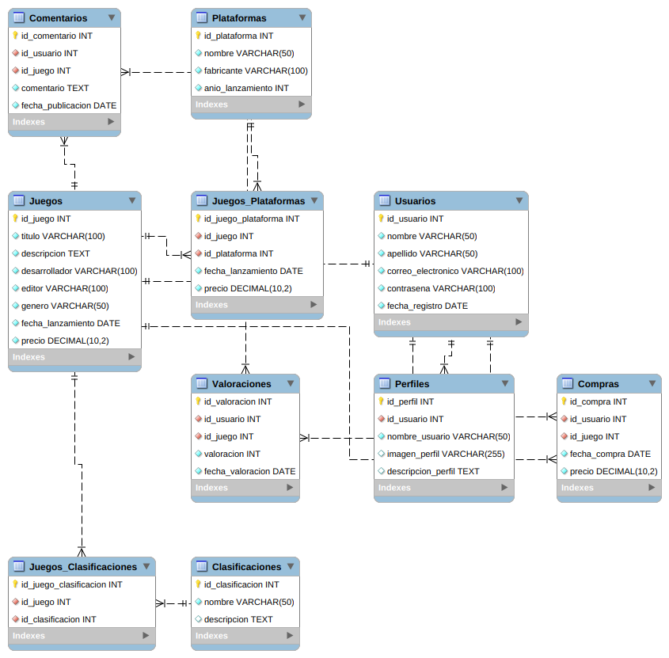

1. Tabla "Usuarios":
    - id_usuario (clave primaria)
    - nombre
    - apellido
    - correo electrónico
    - contraseña
    - fecha de registro

<details>
<summary> &#128427; descripción </summary>
Usuarios: Esta tabla almacena información sobre los usuarios de la tienda de videojuegos, incluyendo su identificación, nombre, apellido, correo electrónico, contraseña y fecha de registro. Es importante tener esta información para poder gestionar las cuentas de usuario, permitir el acceso a los juegos comprados y poder enviar promociones y noticias relevantes.
</details>

2. Tabla "Perfiles":
    - id_perfil (clave primaria)
    - id_usuario (clave foránea a la tabla "Usuarios")
    - nombre de usuario
    - imagen de perfil
    - descripción de perfil

<details>
<summary>&#128427; descripción </summary>
Perfiles: Esta tabla almacena información sobre los perfiles de usuario, incluyendo su identificación, identificación de usuario, imagen de perfil y descripción. La información del perfil puede ser mostrada públicamente en la tienda, y los usuarios pueden personalizarla según sus preferencias.
</details>

3. Tabla "Juegos":
    - id_juego (clave primaria)
    - título
    - descripción
    - desarrollador
    - editor
    - género
    - fecha de lanzamiento
    - precio

<details>
<summary>&#128427; descripción </summary>
Juegos: Esta tabla almacena información sobre los juegos disponibles en la tienda de videojuegos, incluyendo su identificación, título, descripción, desarrollador, editor, género, fecha de lanzamiento y precio. Esta información es esencial para que los usuarios puedan explorar y comprar juegos.
</details>

4. Tabla "Plataformas":
    - id_plataforma (clave primaria)
    - nombre
    - fabricante
    - año de lanzamiento

<details>
<summary>&#128427; descripción </summary>
Plataformas: Esta tabla almacena información sobre las plataformas de videojuegos compatibles con la tienda, incluyendo su identificación, nombre, fabricante y año de lanzamiento. Es importante tener esta información para que los usuarios puedan filtrar los juegos por plataforma.
</details>

5. Tabla "Juegos_Plataformas":
    - id_juego_plataforma (clave primaria)
    - id_juego (clave foránea a la tabla "Juegos")
    - id_plataforma (clave foránea a la tabla "Plataformas")
    - fecha de lanzamiento en la plataforma
    - precio en la plataforma

<details>
<summary>&#128427; descripción </summary>
Juegos_Plataformas: Esta tabla establece una relación entre los juegos y las plataformas en las que están disponibles. Cada registro en esta tabla contiene la identificación del juego, la identificación de la plataforma, la fecha de lanzamiento y el precio del juego en esa plataforma.
</details>

6. Tabla "Clasificaciones":
    - id_clasificación (clave primaria)
    - nombre
    - descripción

<details>
<summary>&#128427; descripción </summary>
Clasificaciones: Esta tabla almacena información sobre las clasificaciones de los juegos, incluyendo su identificación, nombre y descripción. Es importante tener esta información para que los usuarios puedan filtrar los juegos por clasificación, y para garantizar que la tienda cumple con las regulaciones de clasificación de videojuegos.
</details>

7. Tabla "Juegos_Clasificaciones":
    - id_juego_clasificación (clave primaria)
    - id_juego (clave foránea a la tabla "Juegos")
    - id_clasificación (clave foránea a la tabla "Clasificaciones")

<details>
<summary>&#128427; descripción </summary>
Juegos_Clasificaciones: Esta tabla establece una relación entre los juegos y las clasificaciones. Cada registro en esta tabla contiene la identificación del juego y la identificación de la clasificación.
</details>

8. Tabla "Comentarios":
    - id_comentario (clave primaria)
    - id_usuario (clave foránea a la tabla "Usuarios")
    - id_juego (clave foránea a la tabla "Juegos")
    - comentario
    - fecha de publicación

<details>
<summary>&#128427; descripción </summary>
Comentarios: Esta tabla almacena información sobre los comentarios de los usuarios sobre los juegos, incluyendo la identificación del comentario, la identificación del usuario que lo hizo, la identificación del juego al que se refiere, el contenido del comentario y la fecha de publicación.
</details>

9. Tabla "Valoraciones":
    - id_valoración (clave primaria)
    - id_usuario (clave foránea a la tabla "Usuarios")
    - id_juego (clave foránea a la tabla "Juegos")
    - valoración (puntuación del 1 al 5)
    - fecha de valoración

<details>
<summary>&#128427; descripción </summary>
Valoraciones: Esta tabla almacena información sobre las valoraciones de los usuarios sobre los juegos, incluyendo la identificación de la valoración, la identificación del usuario que la hizo, la identificación del juego al que se refiere, la valoración (del 1 al 5) y la fecha de la valoración.
</details>

10. Tabla "Compras":
    - id_compra (clave primaria)
    - id_usuario (clave foránea a la tabla "Usuarios")
    - id_juego (clave foránea a la tabla "Juegos")
    - fecha de compra
    - precio de compra

<details>
<summary>&#128427; descripción </summary>
Compras: Esta tabla almacena información sobre las compras realizadas por los usuarios, incluyendo la identificación de la compra, la identificación del usuario que la hizo, la identificación del juego comprado, la fecha de la compra y el precio pagado.
</details>

#### Las relaciones entre estas tablas serían las siguientes:

- Un usuario puede tener muchos perfiles (relación 1 a muchos entre la tabla "Usuarios" y la tabla "Perfiles").
- Un juego puede estar disponible en muchas plataformas, y una plataforma puede tener muchos juegos (relación muchos a muchos entre la tabla "Juegos" y la tabla "Plataformas", resuelta con la tabla intermedia "Juegos_Plataformas").
- Un juego puede tener muchas clasificaciones, y una clasificación puede aplicarse a muchos juegos (relación muchos a muchos entre la tabla "Juegos" y la tabla "Clasificaciones", resuelta con la tabla intermedia "Juegos_Clasificaciones").
- Un usuario puede hacer muchos comentarios y valoraciones en muchos juegos (relación muchos a muchos entre la tabla "Usuarios" y la tabla "Juegos", resuelta con las tablas intermedias "Comentarios" y "Valoraciones").
- Un usuario puede comprar muchos juegos, y un juego puede ser comprado por muchos usuarios (relación muchos a muchos entre la tabla "Usuarios" y la tabla "Juegos", resuelta con la tabla intermedia


## Gallery 



## Code SQL

<details>
<summary>&#128427; sql </summary>

```sql
-- MySQL Script generated by MySQL Workbench
-- Mon 06 Mar 2023 09:56:54 -05
-- Model: New Model    Version: 1.0
-- MySQL Workbench Forward Engineering

SET @OLD_UNIQUE_CHECKS=@@UNIQUE_CHECKS, UNIQUE_CHECKS=0;
SET @OLD_FOREIGN_KEY_CHECKS=@@FOREIGN_KEY_CHECKS, FOREIGN_KEY_CHECKS=0;
SET @OLD_SQL_MODE=@@SQL_MODE, SQL_MODE='ONLY_FULL_GROUP_BY,STRICT_TRANS_TABLES,NO_ZERO_IN_DATE,NO_ZERO_DATE,ERROR_FOR_DIVISION_BY_ZERO,NO_ENGINE_SUBSTITUTION';

-- -----------------------------------------------------
-- Schema mydb
-- -----------------------------------------------------

-- -----------------------------------------------------
-- Schema mydb
-- -----------------------------------------------------
CREATE SCHEMA IF NOT EXISTS `mydb` DEFAULT CHARACTER SET utf8 ;
USE `mydb` ;

-- -----------------------------------------------------
-- Table `mydb`.`Usuarios`
-- -----------------------------------------------------
DROP TABLE IF EXISTS `mydb`.`Usuarios` ;

CREATE TABLE IF NOT EXISTS `mydb`.`Usuarios` (
  `id_usuario` INT NOT NULL AUTO_INCREMENT,
  `nombre` VARCHAR(50) NOT NULL,
  `apellido` VARCHAR(50) NOT NULL,
  `correo_electronico` VARCHAR(100) NOT NULL,
  `contrasena` VARCHAR(100) NOT NULL,
  `fecha_registro` DATE NOT NULL,
  PRIMARY KEY (`id_usuario`));


-- -----------------------------------------------------
-- Table `mydb`.`Perfiles`
-- -----------------------------------------------------
DROP TABLE IF EXISTS `mydb`.`Perfiles` ;

CREATE TABLE IF NOT EXISTS `mydb`.`Perfiles` (
  `id_perfil` INT NOT NULL AUTO_INCREMENT,
  `id_usuario` INT NOT NULL,
  `nombre_usuario` VARCHAR(50) NOT NULL,
  `imagen_perfil` VARCHAR(255) NULL DEFAULT NULL,
  `descripcion_perfil` TEXT NULL DEFAULT NULL,
  PRIMARY KEY (`id_perfil`),
  INDEX (`id_usuario` ASC) VISIBLE,
  CONSTRAINT ``
    FOREIGN KEY (`id_usuario`)
    REFERENCES `mydb`.`Usuarios` (`id_usuario`));


-- -----------------------------------------------------
-- Table `mydb`.`Juegos`
-- -----------------------------------------------------
DROP TABLE IF EXISTS `mydb`.`Juegos` ;

CREATE TABLE IF NOT EXISTS `mydb`.`Juegos` (
  `id_juego` INT NOT NULL AUTO_INCREMENT,
  `titulo` VARCHAR(100) NOT NULL,
  `descripcion` TEXT NOT NULL,
  `desarrollador` VARCHAR(100) NOT NULL,
  `editor` VARCHAR(100) NOT NULL,
  `genero` VARCHAR(50) NOT NULL,
  `fecha_lanzamiento` DATE NOT NULL,
  `precio` DECIMAL(10,2) NOT NULL,
  PRIMARY KEY (`id_juego`));


-- -----------------------------------------------------
-- Table `mydb`.`Plataformas`
-- -----------------------------------------------------
DROP TABLE IF EXISTS `mydb`.`Plataformas` ;

CREATE TABLE IF NOT EXISTS `mydb`.`Plataformas` (
  `id_plataforma` INT NOT NULL AUTO_INCREMENT,
  `nombre` VARCHAR(50) NOT NULL,
  `fabricante` VARCHAR(100) NOT NULL,
  `anio_lanzamiento` INT NOT NULL,
  PRIMARY KEY (`id_plataforma`));


-- -----------------------------------------------------
-- Table `mydb`.`Juegos_Plataformas`
-- -----------------------------------------------------
DROP TABLE IF EXISTS `mydb`.`Juegos_Plataformas` ;

CREATE TABLE IF NOT EXISTS `mydb`.`Juegos_Plataformas` (
  `id_juego_plataforma` INT NOT NULL AUTO_INCREMENT,
  `id_juego` INT NOT NULL,
  `id_plataforma` INT NOT NULL,
  `fecha_lanzamiento` DATE NOT NULL,
  `precio` DECIMAL(10,2) NOT NULL,
  PRIMARY KEY (`id_juego_plataforma`),
  INDEX (`id_juego` ASC) VISIBLE,
  INDEX (`id_plataforma` ASC) VISIBLE,
  CONSTRAINT ``
    FOREIGN KEY (`id_juego`)
    REFERENCES `mydb`.`Juegos` (`id_juego`),
  CONSTRAINT ``
    FOREIGN KEY (`id_plataforma`)
    REFERENCES `mydb`.`Plataformas` (`id_plataforma`));


-- -----------------------------------------------------
-- Table `mydb`.`Clasificaciones`
-- -----------------------------------------------------
DROP TABLE IF EXISTS `mydb`.`Clasificaciones` ;

CREATE TABLE IF NOT EXISTS `mydb`.`Clasificaciones` (
  `id_clasificacion` INT NOT NULL AUTO_INCREMENT,
  `nombre` VARCHAR(50) NOT NULL,
  `descripcion` TEXT NULL DEFAULT NULL,
  PRIMARY KEY (`id_clasificacion`));


-- -----------------------------------------------------
-- Table `mydb`.`Juegos_Clasificaciones`
-- -----------------------------------------------------
DROP TABLE IF EXISTS `mydb`.`Juegos_Clasificaciones` ;

CREATE TABLE IF NOT EXISTS `mydb`.`Juegos_Clasificaciones` (
  `id_juego_clasificacion` INT NOT NULL AUTO_INCREMENT,
  `id_juego` INT NOT NULL,
  `id_clasificacion` INT NOT NULL,
  PRIMARY KEY (`id_juego_clasificacion`),
  INDEX (`id_juego` ASC) VISIBLE,
  INDEX (`id_clasificacion` ASC) VISIBLE,
  CONSTRAINT ``
    FOREIGN KEY (`id_juego`)
    REFERENCES `mydb`.`Juegos` (`id_juego`),
  CONSTRAINT ``
    FOREIGN KEY (`id_clasificacion`)
    REFERENCES `mydb`.`Clasificaciones` (`id_clasificacion`));


-- -----------------------------------------------------
-- Table `mydb`.`Comentarios`
-- -----------------------------------------------------
DROP TABLE IF EXISTS `mydb`.`Comentarios` ;

CREATE TABLE IF NOT EXISTS `mydb`.`Comentarios` (
  `id_comentario` INT NOT NULL AUTO_INCREMENT,
  `id_usuario` INT NOT NULL,
  `id_juego` INT NOT NULL,
  `comentario` TEXT NOT NULL,
  `fecha_publicacion` DATE NOT NULL,
  PRIMARY KEY (`id_comentario`),
  INDEX (`id_usuario` ASC) VISIBLE,
  INDEX (`id_juego` ASC) VISIBLE,
  CONSTRAINT ``
    FOREIGN KEY (`id_usuario`)
    REFERENCES `mydb`.`Usuarios` (`id_usuario`),
  CONSTRAINT ``
    FOREIGN KEY (`id_juego`)
    REFERENCES `mydb`.`Juegos` (`id_juego`));


-- -----------------------------------------------------
-- Table `mydb`.`Valoraciones`
-- -----------------------------------------------------
DROP TABLE IF EXISTS `mydb`.`Valoraciones` ;

CREATE TABLE IF NOT EXISTS `mydb`.`Valoraciones` (
  `id_valoracion` INT NOT NULL AUTO_INCREMENT,
  `id_usuario` INT NOT NULL,
  `id_juego` INT NOT NULL,
  `valoracion` INT NOT NULL,
  `fecha_valoracion` DATE NOT NULL,
  PRIMARY KEY (`id_valoracion`),
  INDEX (`id_usuario` ASC) VISIBLE,
  INDEX (`id_juego` ASC) VISIBLE,
  CONSTRAINT ``
    FOREIGN KEY (`id_usuario`)
    REFERENCES `mydb`.`Usuarios` (`id_usuario`),
  CONSTRAINT ``
    FOREIGN KEY (`id_juego`)
    REFERENCES `mydb`.`Juegos` (`id_juego`));


-- -----------------------------------------------------
-- Table `mydb`.`Compras`
-- -----------------------------------------------------
DROP TABLE IF EXISTS `mydb`.`Compras` ;

CREATE TABLE IF NOT EXISTS `mydb`.`Compras` (
  `id_compra` INT NOT NULL AUTO_INCREMENT,
  `id_usuario` INT NOT NULL,
  `id_juego` INT NOT NULL,
  `fecha_compra` DATE NOT NULL,
  `precio` DECIMAL(10,2) NOT NULL,
  PRIMARY KEY (`id_compra`),
  INDEX (`id_usuario` ASC) VISIBLE,
  INDEX (`id_juego` ASC) VISIBLE,
  CONSTRAINT ``
    FOREIGN KEY (`id_usuario`)
    REFERENCES `mydb`.`Usuarios` (`id_usuario`),
  CONSTRAINT ``
    FOREIGN KEY (`id_juego`)
    REFERENCES `mydb`.`Juegos` (`id_juego`));


SET SQL_MODE=@OLD_SQL_MODE;
SET FOREIGN_KEY_CHECKS=@OLD_FOREIGN_KEY_CHECKS;
SET UNIQUE_CHECKS=@OLD_UNIQUE_CHECKS;
```

</details>