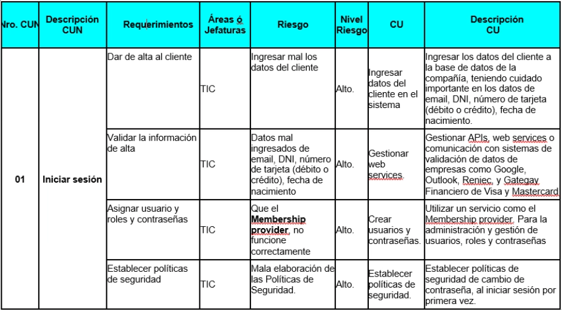
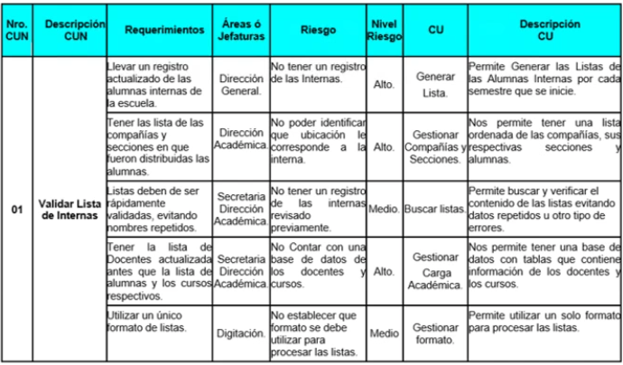

# UML

* Que es UML 
> Es un lenguaje estandar de modelado de sistemas orientados a objetos que significa Unified Modeling Languages. Esto significa que es una manera grafica de representar una situacion

# Modelo
---

* representacion de una realidad
 
* software, problema modelamiento no es una practica

* Year 75 tres amigos UML (Lenguaje unificado de modelamiento).

> se crea el primer modelo  con los tres amigos

    * Grady Booch
    * James Rumbaugh
    * Ivar Jacobson

> RUP es un software > (Rational Unified Process - Rational Rose - IBM).

* Arquitectura de Software (Arquitecura de Datos, Arquitectura de APP. Arquitectura de Seguridad)

## UML VS RESTO DEL MUNDO

* problemas
* tiempo
* costo
* documento
* robusto-complejo

## Modelo

## Modelo de Requerimiento

Matriz de Proceso 

|Nro CUN|Descripcion CUN|Requerimientos|Areas o Jefaturas|Nivel Riesgo|CU|Descipcion|
|---|---|---|---|---|--|--|
|  | | Dar de alta al cliente (generar formulario con sus datos) | TIC | Alto | Ingresar datos de lcliente en el sistema | Ingresar los datos del cliente a la base de datos de la compan~ia, teniendo cuidado importante en los datos de email, DNI |  
| 01 | Iniciar sesion | Validar la informacion de alta | TIC | ALto |   |  |  
|    | | Asignar uauario y roles y password | TIC | Alto |   |  |  
|  |  | Establecer politica de seguridad | TIC | Alto |||

### Iniciar sesion 
---
**Requerimientos**
- dar de alta al cliente (generar formulario con sus datos)
- validar la informacion de alta
- asignar usuario y password
- establecer politicas de seguridad
---
**Areas o Jefaturas**
- TIC 
---
**Riesgo**
- Ingresar mal los datos del cliente
- Datos mal ingresados de email,DNI, numero de tarjeta(debito o cedito), fecha de nacimiento
- Que el *Membership provider*, no funcione correctamente
- Mala elaboracion de las Politicas de Seguridad
---

