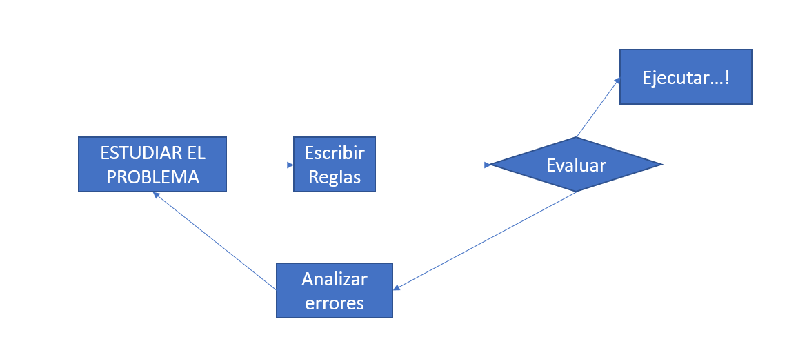
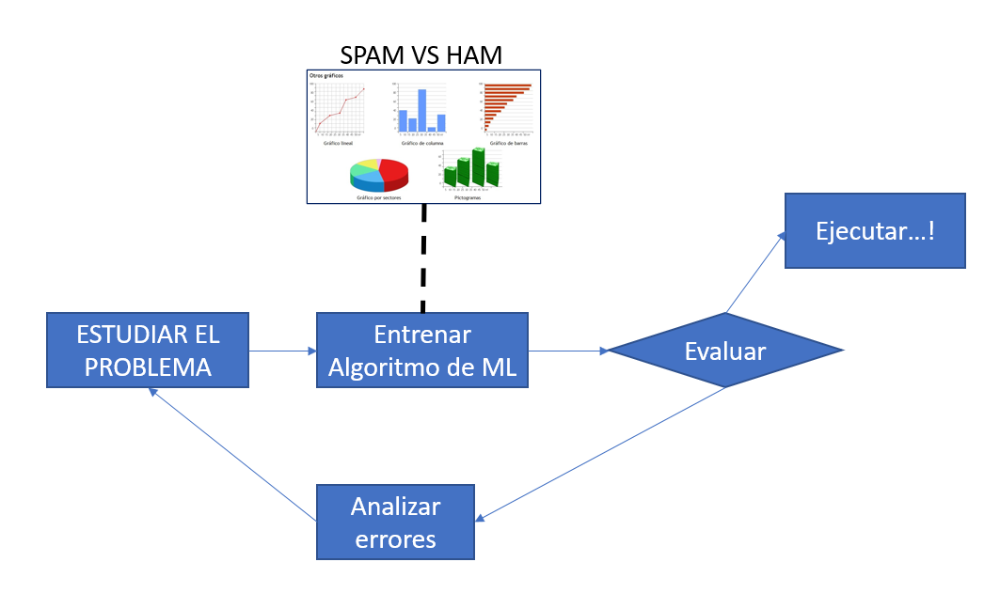
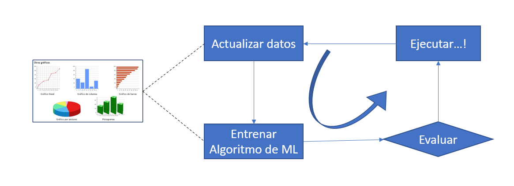
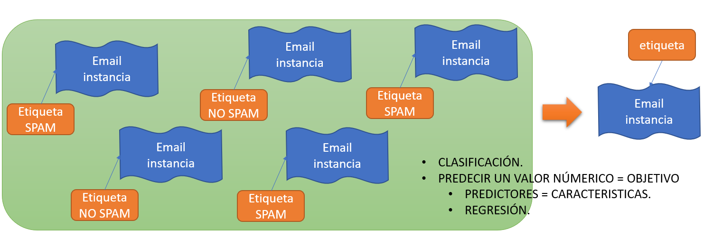

## Machine Learning
Capacidad de un algoritmo de adquirir conocimiento a partir de los datos recolectados para mejorar, describir y predecir resultados

#### Estrategias de Aprendizaje:

* Aprendizaje Supervisado: Permite al algoritmo aprender a partir de datos previamente etiquetados.

* Aprendizaje no Supervisado: El algoritmo aprende de datos sin etiquetas, es decir encuentra similitudes y relaciones, agrupando y clasificando los datos.

* Aprendizaje Profundo (Deep Learning): Está basado en redes Neuronales

#### Importancia del ML
Permite a los algoritmos aprender a partir de datos históricos recolectados por las empresas permitiendo así tomar mejores decisiones.

#### Pasos a Seguir para Desarrollar un modelo en ML

* Definición del Problema: Es necesario definir previamente el problema que va a resolver nuestro algoritmo

* Construcción de un modelo y Evaluación: Una vez definido el problema procedemos a tratar los datos y a entrenar nuestro modelo que debe tener una evaluación cercana al 100%

* Deploy y mejoras: El algoritmo es llevado a producción (aplicación o entorno para el que fue creado), en este entorno podemos realizar las mejoras pertinentes de acuerdo al comportamiento con los usuario e incluso aprovechando los datos generados en esta interacción

## IA 

* IA = IMITAR LA INTELIGENCIA HUMANA.
* INTELIGENCIA = PROCESO DE APRENDIZAJE
* IA = APRENDIZAJE(MACHINE LEARNING) 
* ALGORITMOS.

## HISTORIA IA 
* Reconocimento optico de caracteres (OCR).
*  90s Reconocimiento del SPAM.

##  Donde empieza el Machine Learning? 
* Aprendizaje.
* Aprendizaje supervisado.
* No supervisado.
* Online vs Aprendizaje por lotes.
* Basado en instancias vs Basado en modelos.

## Que es el Machine Learning?
* Ciencia , El Arte, de programar computadoras, automatas, etc. para que aprendan a  partir de datos.
* Ejemplos, cantidad de datos = conjuntos de entrenamiento. 
- Spam
- Programacion tradicional

## Por que el Machine Learning?
* SPAM:
* Programacion tradicional
*
	**Estudiar el Problema** > **Entrenar Algoritmos

**Example**

* Plantear cual es la forma de un SPAM("Para usted...", tarjeta de credito", "gratis", "impresionante",etc.) otros patrones: mensajes repetitivos, anuncios, ofertas, procedencia extrana(estudiar el problema).
* Escribir el algoritmo de deteccion de patrones observados (Escribir las reglas).
* Probar, ejecutar...(repetir el paso 1 y el paso 2).
**SPAM**
- Diccionario de Var:
- Begin
	- Conectar a DB.
	- Si db = tru entonces
	- Inicio
		- Asunto = Obtener los asuntos de los emails
		- Si asunto = "gratis" entonces
		- Inicio
			- Email es spam
		- Fin
	- Sino
	- Si asunto = "tarjeta de credito" entonces
		- Inicio
			- Email es Spam
		- Fin
	- Fin
- End.

**AlGORITMO** 
- Filtro de Spam basado en Machine Learning.
	- Aprende de forma automatica palabras, frases, atipicamente frecuentes, que nos permitan predecir que es un spam, patrones.
	- Lista de datos de posibles correos  Spam vs Ham.
- El algoritmo y el programa, sea mas cortos, es mas facil de entender, mas facil de mantener, mas exacto.

**MINERIA DE DATOS**

- los que envian el Spam, se dan cuenta " Tarjeta de credito", son bloqueados, ahora te mandan "Credit card", "regalo".
- Evitar el filtro.
- Tecnica 

#### Enfoque de Machine Learning

_Estudiar el problema_ --> *Entrenar Algoritmo de ML --> Evaluar --> Ejecutar...!

## Adaptacion al cambio de forma automatica 
**Entrenar Algoritmo de ML
Actualizar datos
Evaluar 
Ejucutar

## Solucion - Distinga "UNO(1)"-"DOS(2)"
* Diccionario Var: voz= sonido
  * Conjunto de entranamiento: [grabaciones de voz]
* Begin 
  * Escuchar escucha = new Escuchar()
  * Escuchar(voz)
  * Si voz = "uno" entonces 
    * Print("1")
  * Sino 
    * Si voz= "dos" entonces 
    * print("2")
* End

## Machine Learning 

* Problemas cuya soluciones requieren muchos ajustes o largas listas de reglas 
* Problemas complejos, los que no se pueden soluvionar de manera tradicional. 
* Entornos volatiles, cambiantes, las soluciones de ML deben adaptarse rapidamente al cambio 
* Entender problemas complejos  con grandes cantidades de datos.
* Aplicar tecnicas ML explora a fondo cantidades de datos que ayuden a descubrir patrones.(Mineria de datos)

## Tipos de sistemas ML 

- **Modelos que se entran o no bajo supervision humana.**
  - Aprendizaje supervisado.
  - No supervisado. 
  - Semi supervisado.
  - Aprendizaje por refuerzo. 
- **Modelo que puede o no aprender de forma gradual sobre la marcha.**
  - Aprendizaje online.
  - Aprendizaje po lotes.

- **Modelo comparando datos nuevos contra datos conocidos, o detectan patrones en los datos de entrenamiento y crean modelos predictivos.**
  - Aprendizaje basado en instancias.
  - Aprendizaje basado en modelos.

### Aprendizaje Supervisado y no Supervisado
 
- Aprendizaje supervisado:
  - El conjunto de entrenamiento que usamos en el algoritmo incluye las soluciones deseadas, soluciones deseadas = etiquetas

### Atributos vs Caracteristica

- En el ML, un atributo = tipo de datos (

### Atributos vs Caracteristica

- En el ML, un atributo = tipo de datos (ej. El kilometro)
- En el ML, caracteristica tiene mucho significadosm depende del contexto = atributo + valor (ej. Kilometraje = 15000)

### Algoritmos de aprendizaje supervisado 

- K vicino mas cercano 
- Regresion lineal
- Regresion logistica
- Maquinas de vector soporte. 
- Arboles de decision(random forest).
- Redes Nuronales.

### Aprendizaje supervisado y no supervisado 

- Aprendizaje no supervisado 
  - El conjunto de entrenamiento no usa etiquetas. 

### Algoritmos de aprendizaje no supervisado 

- Agrupacion:
  - K-Medias.
  - DBScan.
  - Analisis de agrupamiento en jerarquias.
- Deteccion de anomalias y detencion de novedades:
  - SVM de una clase.
  - Isolation forest 
- Reglas de asociacion:
  - A priori
  - Eclat.
- Visualizacion y reproduccion de la dimensionalidad
  - Analisis de componentes principales (PCA).
  - Tecnica t-SNE
  - LLE (Locally Linear Embedding)
  - Analisis con kernel de componentes principales 
